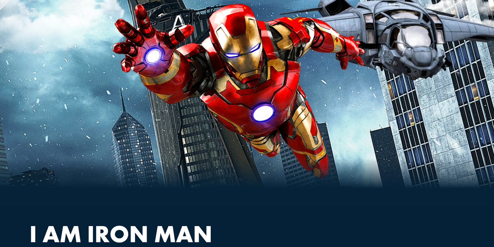

<p id="header"><p>

<table><tr>
<td> <a href="https://github.com/emjose/video-scroll-two/#header"></a> </td>
<td> <a href="https://github.com/emjose/one-hundred/#header"></a> </td>
<td> <a href="https://github.com/emjose/split-landing-page/#header"></a> </td>
</tr></table>

<br>

<p id="project-title"><p>

<a href=#table-of-contents></a> 

<br>

<a href="https://emjose.github.io/parallax-scroll/"></a> 

#

<p id="table-of-contents"><p>

<a href=#table-of-contents></a>  

- [100 Days of Code](#100days)
- [Installation](#installation) 
- [Live Site](#live-site)
- [Resources](#resources)
- [Copyright](#copyright)
- [Let's Connect!](#lets-connect) 

#

<p id="100days"><p>

<a href=#100days></a>  

### Day 17: February 24, 2021
- I followed a <a href="https://youtu.be/zIlXK2_bxZc">cool Youtube tutorial</a> on an Iron Man parallax effect. 

- The tutorial introduced me to the <a href="https://greensock.com/">GreenSock Animation Platform (GSAP)</a> and its powerful <a href="https://greensock.com/scrolltrigger/">ScrollTrigger</a> plugin.

- The text in the parallax scroll effect is from Tony Stark's monologue in the Marvel Studios film, <a href="https://www.marvel.com/movies/avengers-endgame">Avengers: Endgame</a>. Tony Stark is portrayed by the actor <a href="https://www.imdb.com/name/nm0000375/">Robert Downey Jr</a>.


#

<p id="installation"><p>

<a href=#installation></a>

#### Git clone and cd into the repo folder:
``` 
git clone git@github.com:emjose/parallax-scroll.git && cd parallax-scroll
```
#### Run the command:
```
open index.html
```

#

<p id="live-site"><p>

<a href="https://emjose.github.io/parallax-scroll/"></a>  

<a href="https://emjose.github.io/parallax-scroll/"></a>

#

<p id="resources"><p>

<a href=#resources></a>  

- #### [Iron Man Parallax Tutorial, Part 1](https://youtu.be/zIlXK2_bxZc) by [Technical Tuts 4u](https://www.youtube.com/channel/UCeDbQlQY8jP9wGmBaVWhHMA)

- #### [Iron Man Parallax Tutorial, Part 2](https://youtu.be/NR2vyUulNXQ) by [Technical Tuts 4u](https://www.youtube.com/channel/UCeDbQlQY8jP9wGmBaVWhHMA)

- #### [GSAP: GreenSock Animation Platform](https://greensock.com/)

- #### [ScrollTrigger plugin by GreenSock](https://greensock.com/scrolltrigger/)

- #### [My blog on how I created my Github READMEs](https://emmanueljose.medium.com/readme-a-makeover-story-b9c7be37a6de?sk=7ae6623d365409d875753e4604e42ffd) 

#

<p id="copyright"><p>

<a href=#copyright></a>

- This project is for made for educational purposes only. 
  
- All Iron Man images and characters are copyright of <a href="https://www.marvel.com/">MARVEL</a>. © MARVEL. All Rights Reserved.

#

<p id="lets-connect"><p>

<a href=#lets-connect></a>

<p><a href="https://twitter.com/Emmanuel_Labor"> <a href="https://www.linkedin.com/in/emmanuelpjose/"> <a href="https://emmanueljose.medium.com/"> <a href="https://www.instagram.com/emmanuel_jose/"> <a href="mailto:emjose@gmail.com"> <a href="https://www.youtube.com/channel/UCQdqFg-_J83jn9xJRd1W3tQ/videos"> <a href="https://github.com/emjose"></p>

#

<a href=#header></a>